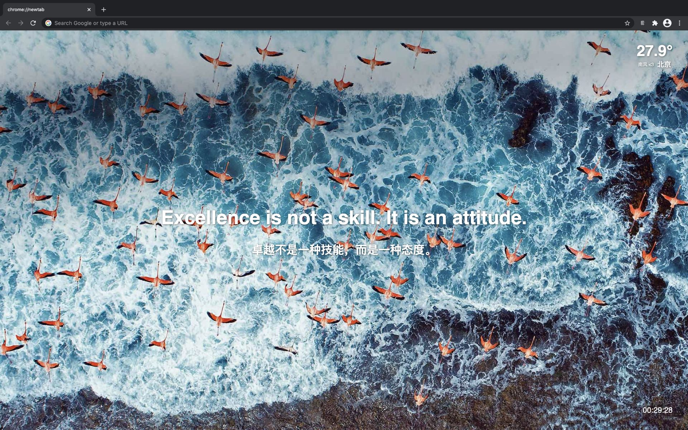

## Daily Sentense
A Chrome extension of replace new tab page. Currently only support Chrome browser.

### Development

1. Clone this repo
2. `npm install`
3. `npm run dev`
4. Open Chrome extension page
5. Check "developer mode"
6. Click "load unpacked extension", and choose dist folder.

